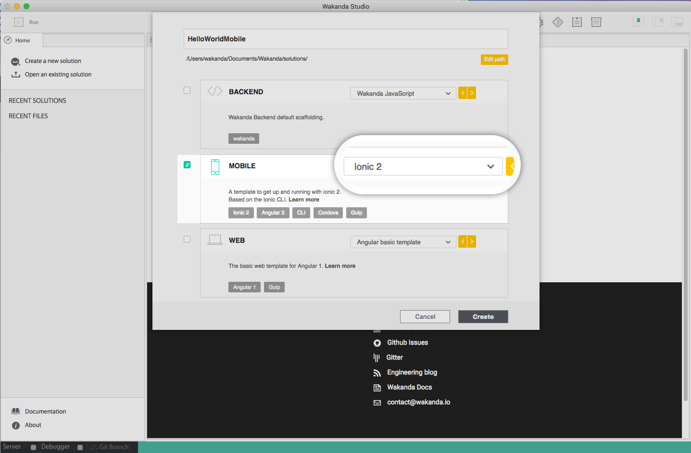
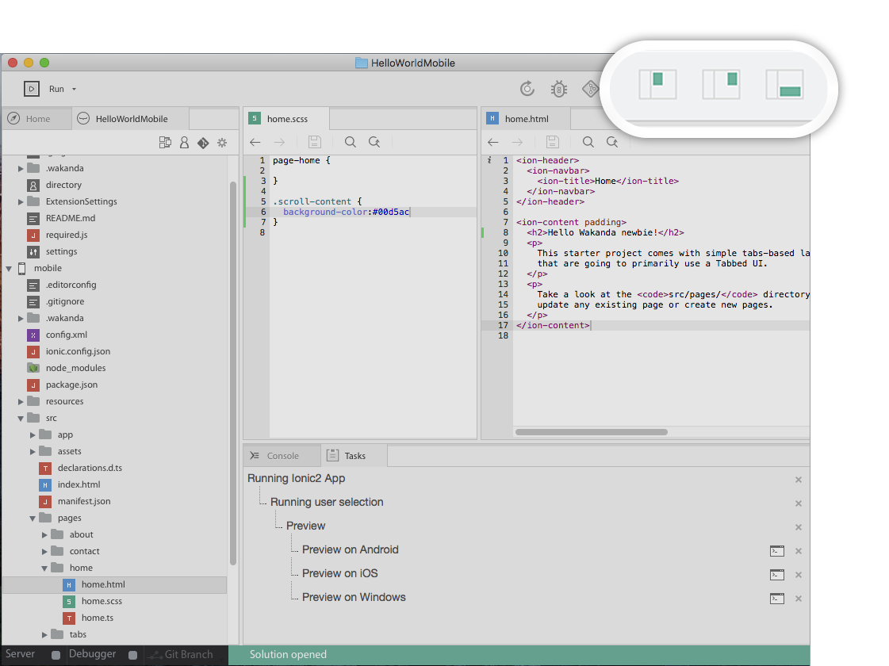
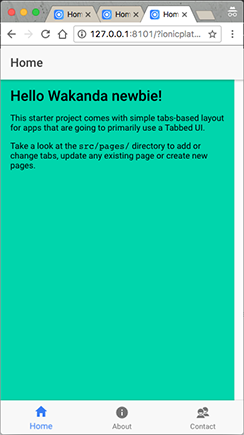
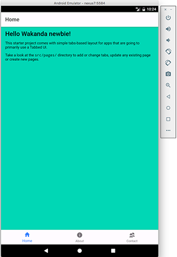

# Hello World: your first Mobile hybrid App

## Step 1: Install Wakanda

First, download and install **Wakanda Community Edition**

- On Windows, [x86](https://github.com/Wakanda/wakanda-digital-app-factory/releases/download/v1.1.3/wakanda-community-all_1.1.3_x86.msi "download") or [x64](https://github.com/Wakanda/wakanda-digital-app-factory/releases/download/v1.1.3/wakanda-community-all_1.1.3_x64.msi "download")
- On Mac OS X, [x64](https://github.com/Wakanda/wakanda-digital-app-factory/releases/download/v1.1.3/wakanda-community-all_1.1.3_x64.dmg "download")


Now we can start our **HelloWorld** project.  

## Step 2: Choose your template

We can choose the components we want in our app amoung mobile front, web front and back-end.

In this example we are going to create a Hello World for an *Android app with Ionic2*

> **WARNING**:
> -You need to use Angular2 to create an app with Ionic2, but you don't need any Angular2 knowledge for this **Hello World**. It works the same way with an other template.


To do that, we're going to launch the studio  and click on **"Create a new solution"**:


Which opens the template selection page:  




The structure of your future projects depends on the template you choose. 

For our mobile **Hello World**, we just need a mobile front-end, with the **Ionic2 blank template**.

Now, at the root of your project, you have 2 folders:

- **HelloWorldMobile:** where you can access your solution settings, logs and directory. 
- **Mobile:** where you’ll find all your front-end files to develop and build your mobile app. 

In your **Mobile:** folder, you can find the classical Ionic2 project file structure [More info here](https://ionicframework.com/docs/v2/intro/tutorial/project-structure/ "ionic tutorial").:

That's where we are going to work for this **Hello World**

  


## Step 3: Check for dependencies

Mobile apps are based on **AngularJS**, **Ionic** and **Cordova**.

For mobile apps, you need to check for any missing dependencies.
Go in the main menu  (_Help_ > _Wakanda Troubleshooting_) and choose Mobile and then Android.


Here you can see that Homebrew, Apache and Android SDK are missing. Everything is explained there: why I need them, and how to install them.


## Step 4: Code and preview  

Once all your dependencies are checked you can preview your app.

Just click on your project, and then on **"Run"**.

> **TIPS**:
> - The first click on **Run** opens the mobile preferences. You can access it later in (_Run_>_Mobile_Preferences)
> - You can choose on which OS you want to run your mobile app, and the way you want to visualise it: **Preview**, **Emulator** or **Device** 


In the`mobile`folder, `src`is the classical ionic2 project's structure.

Let's add a change in the home page for this **HelloWorld** :

- In `mobile/src/pages/home/home.html`,replace:

```html
<h2>Welcome to Ionic!</h2>
```
with:
```html
<h2>Hello Wakanda newbie!</h2>
```

- To make it more visual, change the home page background color in its style's file `mobile/src/pages/home/home.scss` by adding:

```css
.scroll-content {
  background-color::#00d5ac
} 
```


> **TIPS**:
> - You can split your screen, and moove tabs to make it easier to work with.

The preview is automatically reloaded after each saving.




## Step 5: Run on emulator  

Now you can run your app on the [Android emulator](https://developer.android.com/studio/run/emulator.html "check documentation").

In Run dropdown, go in mobile preferences, select Emulate, for Android.



## Step 6: Run on device  


Make sure you have [USB debugging enabled](http://developer.android.com/tools/device.html).

Wakanda Studio automatically detects supported device when connected to the USB port.
In Run dropdown, go in mobile preferences, select Device, for Android.


<div class="navigation-step">
  <a class="btn next-button" href="hello-world-web-2.html">Next: Create a web app in Angular<i class="icon-chevron-right"></i></a>
</div>
