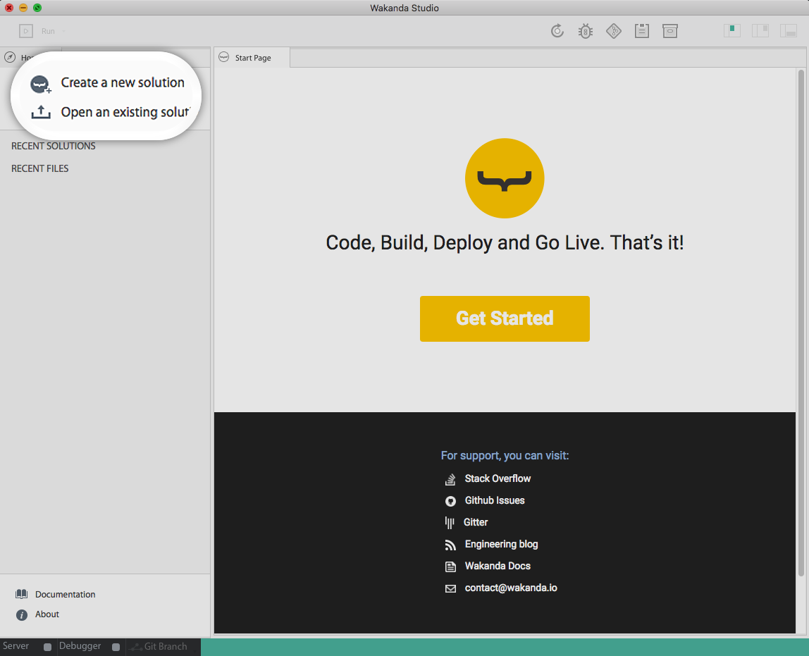

# Hello World: your first Web App with Angular

## Step 1 : Install Wakanda

First, download and install **Wakanda Enterprise Edition**

- On [Windows](https://wakanda.github.io/download.html#section-download "download")
- On [Mac OS X](https://wakanda.github.io/download.html#section-download "download")


> **TIPS**: 
> - Wakanda supports Windows 10, Windows Server 2016, macOS 10.11 or above and Ubuntu 16.04 LTS

Now we can start our **HelloWorldWeb** project.  

## Step 2: Choose : mobile or web app, angular or angular2 ?

We can choose the kind of app we want to create : mobile, web or both.

Here we want to create an *Angular web app*.

To do this: 

- open the studio 

- click on **"Create a new solution"**:



Which opens the template selection page:  


For a Hello World we don't need a back-end. So, select only **web**, to have a web front-end, with the **Angular1 template**.

Name your app **HelloWorldWeb**, and click on **Create**

In the left panel, a tab with the name of your solution **HelloWorldWeb** is now openned.

You can find two folders:
- **HelloWorldWeb**: it contains the files of your solution.
- **web**: it contains your web front-end project structure.

  

> **TIPS**:  
> - You can create multiple web (or mobile) front-ends by right-clicking on the name of your solution (_New_>_Project_)

For our **HelloWorldWeb** we’re only going to work in the `web` folder.


## Step 3: Run your web application

First let's have a look to our web template.

Click on the _Run_ toolbar button:


## Step 4: Code your Angular application

Let's have a look to our `web project structure : as for a classical Angular app file structure, you have the `index.html` file and folders `app` and `assets` at the root.

- `index.html` handles loading in all the libraries and Angular elements
- `assets` is very standard: it contains all the shared assets as css, images, librairies
- `app` is the core of your app. It contains all your controllers.

A simple change in `web/index.html` and I have my **HelloWorld** done:
```html
<h1>Hello Wakanda Newbies!</h1>
```
To make it more visual, you can change the background color in its css file `web/assets/css/style.scss`:

```css
body {
    background-color: #51D8C6;
}
#wakanda-logo {
    margin: 0;
    max-height: 50%;
    max-width: 50%;
}
```

> **Tips:** The preview is automatically reloaded after each saving.


---


