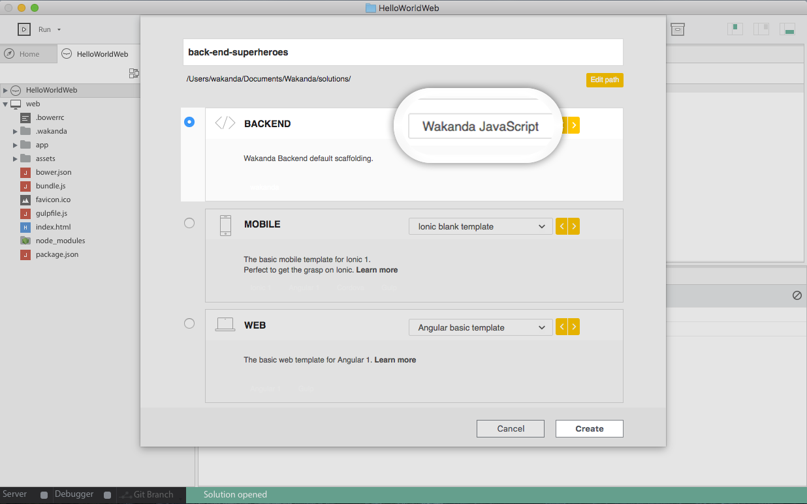
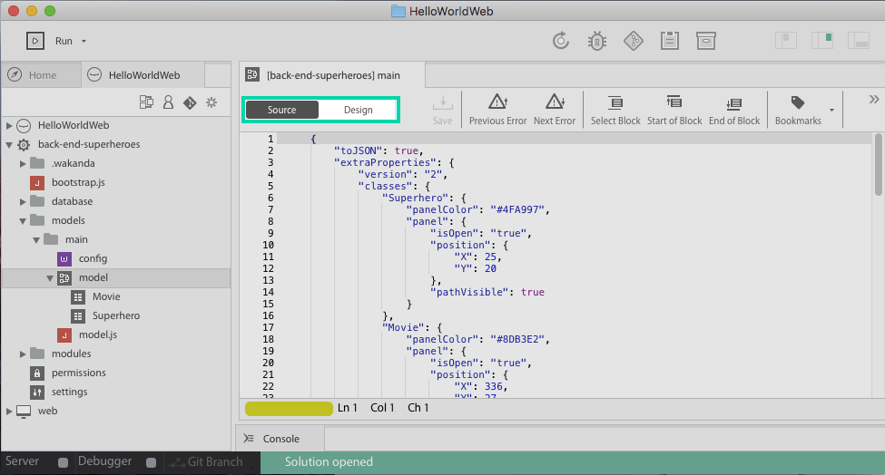

# Populate the built-in DataBase

Now, let's make our **HelloWorld** web app more interesting by accessing data from the built-in DB.

What about saying "Hello !" to your favorite superheros ? Let's populate the database with them.

## Step 1: Add a javascript Back-End project to your solution

First we need to add a back-end project. It will contain the data, datamodel and the business code.

- Right-click on the name of your solution. (_New_>_Project_) (or command+shift+N).
- Name your solution "back-end-superheroes"
- Select "Back-end" and "Wakanda Javascript"
- Click on create



## Step 2: Edit you data model Visually

First, we're going to create our datamodel.

To manage your data easily and quickly, Wakanda provides a **Visual Data Editor**. 

It allows you to create your classes, and their properties visually.


1 - Create a `Superhero` and a `Movie`dataclasses. 

Give them respectively the attribute `name` and `title` of type `string` and save.


> **TIPS**:  
> - The attribute `ID` is given by default to all dataclasses created. The classes instantiation are named "Entity" in Wakanda. 
> - They are similar to classical js class instanciation, except a new ID is automatically created at each generation in order to keep entities uniqueness in the datastore.

2 - Add an attribute `movie` to `Superhero`dataclass and give it the type `Movie`.
The relationship between the two classes is automatically displayed in the model


The JSON file of your datamodel is automatically updated each time you save.


> **TIPS**:  
> - You can click on "source" button to see the JSON file generated 
> - `ds` is the object representing the whole datamodel, corresponding to this JSON file.
> - Two objects constructors have been generated : `Superhero` and `Movie`.



## Step 2 : Generate data

Now, we are going to write a small javascript script to generate data:

- Create a folder `script` at the root of `back-end-superheroes` (Right click on the folder and _New_ >_Folder_)
- Add a js file `addSuperheroes.js` in it (Right click on the folder or _File_ > _New_ >_JS File_).
 
- Use the generated constructor `Superhero` to add your top 3 `Superhero` in the the built-in database.

```javascript
ds.Superhero.remove(); //clean the database from all former Superhero generated
new ds.Superhero({name:"Batman"}).save();
new ds.Superhero({name:"Wolverine"}).save();
var favoriteSupehero = new ds.Superhero({name:"Wonder Woman"});
favoriteSupehero.save();
ds.Superhero.all();
```

- click on the "Play" icon.

Your three favorite superheroes are now saved in the datastore !


> **TIPS**:  
> - The constructors generated by the visual editor always take an object as argument (not the attributes values unlike a classical JS object constructor).
> - `save()` is a Wakanda method used to save the JSON corresponding to the Entity (meaning only its attributes) in the datastore. 


> **WARNING**:  
> - The JSON saved are not related to the `var favoriteSuperhero` in the datastore, nor in your front-end calls.


<div class="navigation-step">
  <a class="btn next-button" href="bind-data-in-webapp-2.html">Next: Display your data <i class="icon-chevron-right"></i></a>
</div>
