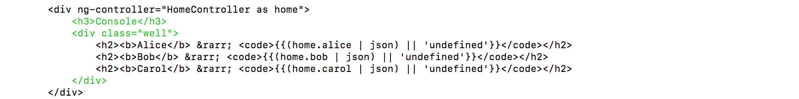

### JavaScript Principles

# Access properties of nested objects

Can you guess what the last line returns?

    var alice = {
        bob: {
            a: 42,
            b: true
        }
    };
    var carol = alice.bob;
    alice.bob.b = false;
    carol;

<iframe src="https://player.vimeo.com/video/212878845" width="1170" height="658" allowtransparency="true" frameborder="0" webkitallowfullscreen="" mozallowfullscreen="" allowfullscreen=""></iframe>

You have learned:

*   An object can be written on several lines, especially with properties on separate lines and indented.
*   An object property can be a primitive value but also an **object** value. Such property holds a reference to a **nested** object.
*   You can chain the _dot_ notation (and also the _bracket_ notation) to access properties of nested objects: `alice.bob.b`, `alice.bob['b']`, `alice['bob'].b` or `alice['bob']['b']`.

 

### Learn with Wakanda
# Update your template

Open the `index.html` template file and update the markup. For example, add a title and a block around the value logs:

Again, Wakanda automatically reloads your application:

The next chapter is coming soon! Follow us on [@WakandaSoft](https://twitter.com/wakandasoft){:target="_blank"} to catch it!

