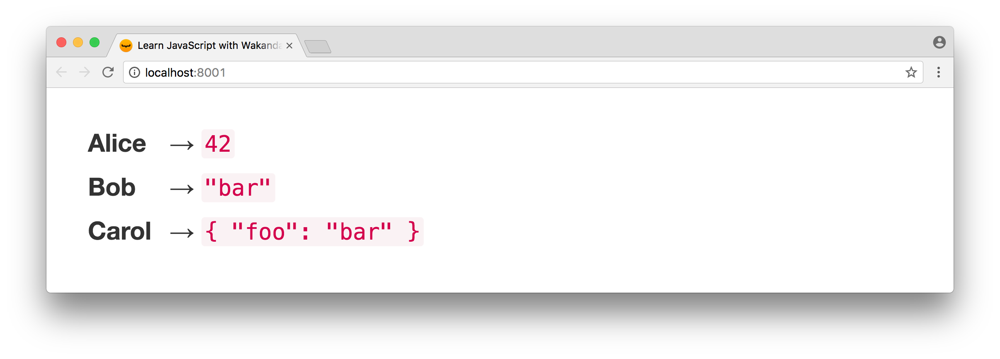

### JavaScript Principles

# Assign object values

Do you remember the [Assign primitive values](assign-primitive-values.html) lesson? Let’s see how it works with _object_ values. Can you guess what the last line returns?

    var alice = {foo: 'bar'};
    var bob = alice;
    alice.foo = 'wat';
    bob.foo;

<iframe src="https://player.vimeo.com/video/211657141" width="1170" height="658" allowtransparency="true" frameborder="0" webkitallowfullscreen="" mozallowfullscreen="" allowfullscreen=""></iframe>

_Object values_ are always assigned by **reference-copy**. In `bob = alice;`, `bob` is assigned a **copy** of the reference held by `alice`. `alice` and `bob` are two references pointing to the same shared `{foo: 'bar'}` object value.

**You have learned:**

<table class="table table-bordered">

<thead>
<tr>
<th>Data Type</th>
<th>Held by</th>
<th>Assigned by</th>
</tr>
</thead>
<tbody>
<tr>
<th>Primitive values</th>
<td>variables</td>
<td>value-copy</td>
</tr>
<tr>
<th>Object values</th>
<td>references</td>
<td>reference-copy</td>
</tr>
</tbody>
</table>

 

### Learn with Wakanda
# Update your code

Open the `app/controllers/home.js` file.

Remove the `// write your code here` comment and try different values for `alice`, `bob` and `carol`. For example:

Save your changes.

Wakanda automatically reloads your application in your browser:

In the [next lesson](access-properties-nested-objects.html), you'll see that _live-reload_ works on other file types.

