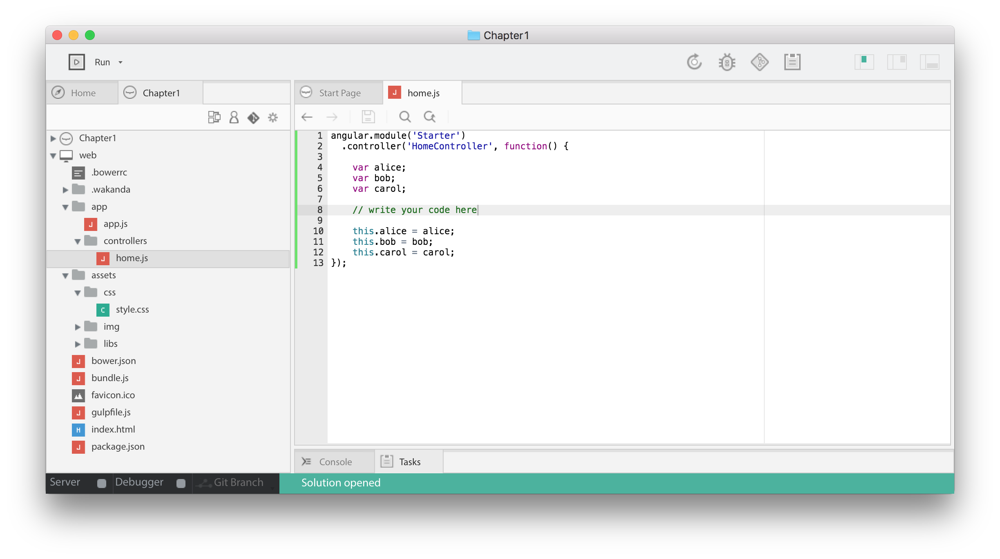

### JavaScript Principles
# Assign primitive values

Can you guess what the last line returns?

    var alice = 'foo';
    var bob = alice;
    alice = 'bar';
    bob;

<iframe src="https://player.vimeo.com/video/208474345" width="1170" height="658" allowtransparency="true" frameborder="0" webkitallowfullscreen="" mozallowfullscreen="" allowfullscreen=""></iframe>

_Primitive values_ are always assigned by **value-copy**.

In `bob = alice;`, `bob` is assigned a **copy** of `alice`‘s value: the `'foo'` value.
In JavaScript, you can’t have a variable `alice` pointing to another variable `bob`.

 

### Learn with Wakanda
# Discover the main application files

## JavaScript Controller

What if you could try the challenges of this course yourself? Let's create an app for that!

Open the `app/controllers/home.js` file. Replace its content with the following code:

**TIPS**: close the bottom panel with the third toggle (in the upper-right corner):

## HTML/CSS View

We want to display the content of the `alice`, `bob` and `carol` values on a web page.

Edit the `index.html` page and replace its content with the following markup:

Open the `assets/css/style.css` style sheet to edit the look and feel of our web page. Replace its content with the following code:

In the next chapters of this course you'll learn how to write those JavaScript, HTML and CSS files yourself.

For now, read the [next lesson](set-properties.html) to run this app.

