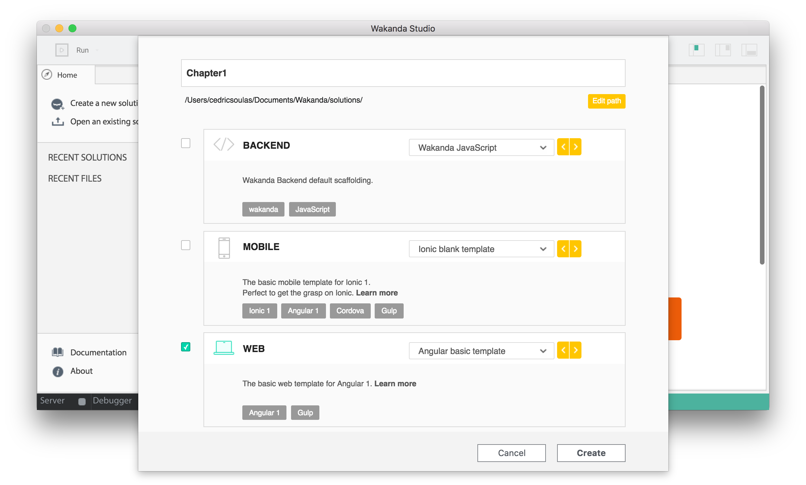
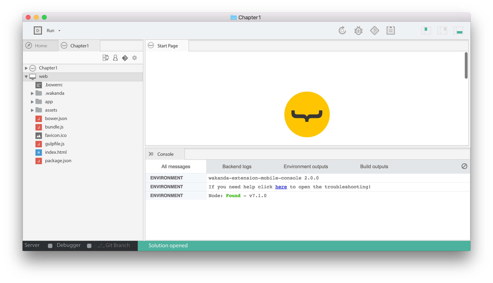

### JavaScript Principles

# Declare variables, initialize with primitive values

The `var` statement declares a variable, optionally initialized to a value.

In the following code sample, do you know what _values_ `alice` and `bob` hold?

    var alice;
    var bob = 42;

Watch the answer on this video:

<iframe src="https://player.vimeo.com/video/208474337" width="1170" height="658" allowtransparency="true" frameborder="0" webkitallowfullscreen="" mozallowfullscreen="" allowfullscreen=""></iframe>

# Initialize a variable with an object

Do you know what _value_ `carol` holds?

    var carol = {a: true};

This is not as obvious as it may seem:

<iframe src="https://player.vimeo.com/video/208651639" width="1170" height="658" allowtransparency="true" frameborder="0" webkitallowfullscreen="" mozallowfullscreen="" allowfullscreen=""></iframe>

**You have learned**:

*   **Primitive values** (`Number`, `String`, `Boolean`…) are held directly by variables
*   **Non-primitive values** (objects) are held by references, not by variables

 

### Learn with Wakanda

# Create a new solution

In the [first lesson](data-types.html), you discovered data types and started Wakanda Studio. With this second lesson, you have now learned the concept of values and variables in JavaScript. You are now ready to create a new application to start playing with JavaScript.

Click on "Create a new solution". We'll focus on a **web** application with an _Angular basic template_:

Your new web application is automatically generated:

The console checks that `node` is installed. If you read "not found", please [install node](https://nodejs.org/en/){:target="_blank"} (it only takes a minute).

The next lesson is coming soon! Follow us on [@WakandaSoft](https://twitter.com/wakandasoft){:target="_blank"} to catch it!

