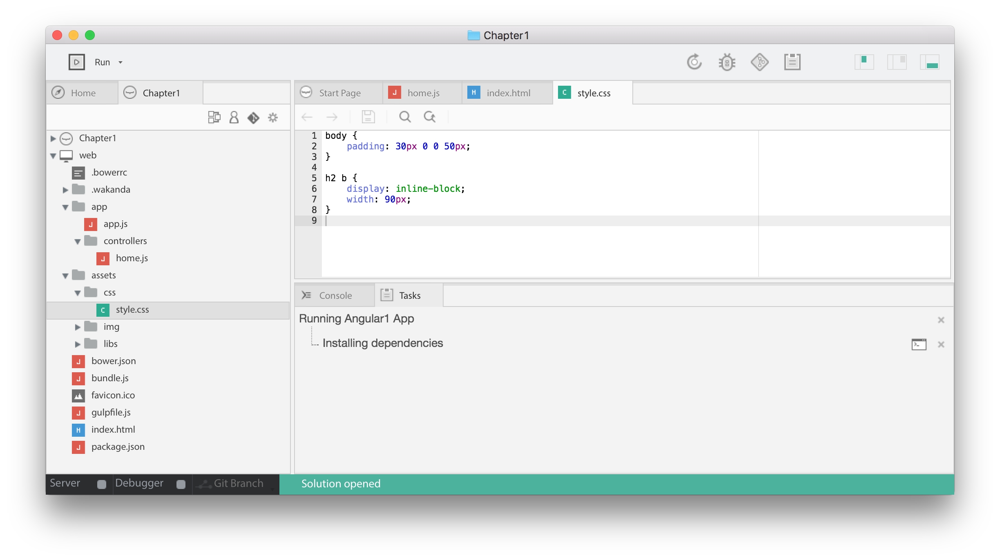
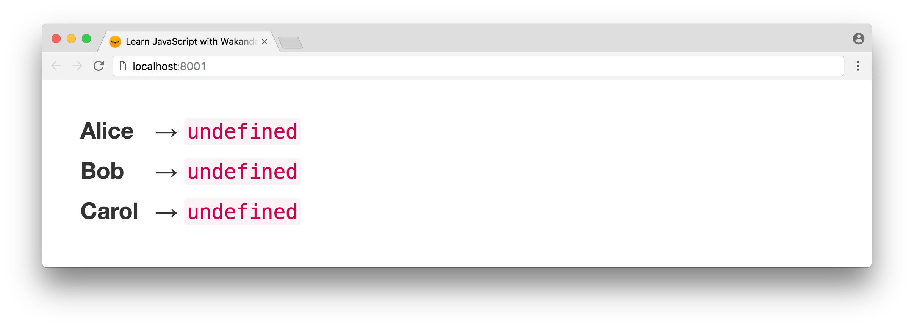

### JavaScript Principles

# Set a property with `[]` or `.`

An `object` is a _compound value_. You can set properties holding their own values.

Can you guess what the last line returns?

    var alice = {};
    alice['foo'] = true;
    alice.foo = 42;
    alice;

<iframe src="https://player.vimeo.com/video/208474357" width="1170" height="658" allowtransparency="true" frameborder="0" webkitallowfullscreen="" mozallowfullscreen="" allowfullscreen=""></iframe>

 

### Learn with Wakanda
# Run your app

Click on _Run_:

Wakanda automatically setup your application:

After a few seconds, your application opens in your browser:

For now, `alice`, `bob` and `carol` are `undefined`. In the next lessons, we'll edit `home.js` and try different values.

The next lesson is coming soon! Follow us on [@WakandaSoft](https://twitter.com/wakandasoft){:target="_blank"} to catch it!

